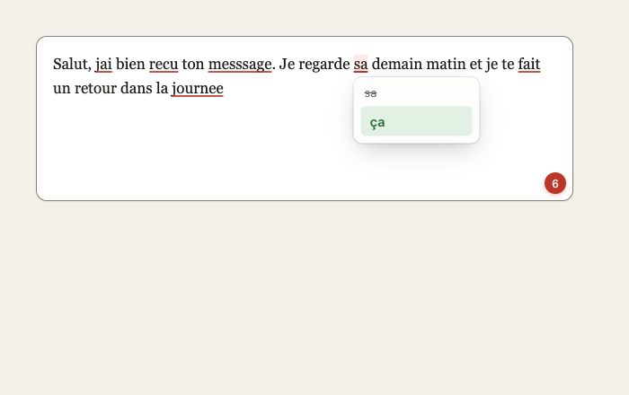
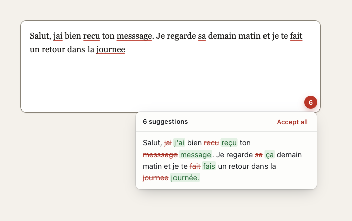

# ai-grammar

|  |  |
| :----------------------------------------------------------: | :------------------------------------------------------: |

> Completely free and open source Chrome AI Grammar Check Extension

This is a fork of [nucleartux/ai-grammar](https://github.com/nucleartux/ai-grammar). It changes how suggestions are shown and applied, and switches the Ollama provider to a smaller, faster model. The Chrome Web Store build below is the upstream version and has none of these changes. To get them, build the extension from this repository (see [Developing](#developing)).

- Completely free. No subscriptions required. No ads.
- Absolutely safe. AI works on your machine. No data sent to the internet.
- Smart grammar check. Checks full sentences, not only individual words.

[Download the upstream version from the Chrome Web Store](https://chromewebstore.google.com/detail/free-ai-grammar-checker/jnkjkpapplndagboidnhphaciphgjeca)

## What this fork changes

- Mistakes are underlined in the text field, in both `<textarea>` and `contenteditable` elements.
- Hovering an underlined word opens a card with the fix. Clicking it replaces that word and leaves the rest of the text alone.
- Hovering the badge in the corner of the field lists every suggestion. Click one change to apply it, or "Accept all".
- Edits go through the browser's editing commands, so Cmd+Z / Ctrl+Z undoes them and frameworks like React see the change.
- The check runs 800 ms after you stop typing instead of on every keystroke.
- Ollama uses `gemma4:e2b-it-qat` by default. It fixed every case in the [benchmark](#benchmark) and answers in about half a second.
- The overlays follow the light or dark look of the page and respect `prefers-reduced-motion`.

## Installing

For installation you have two options (you need to choose **only one**):

**First option: Using Built-in AI in Chrome 138+:**

1. Install Chrome 138 or above
2. That's all. Use the extension. You might need to wait the first time while the model is loading, but further interactions should be almost instant (although it depends on your hardware, of course).

If something goes wrong reload the page, if it doesn't work please [open an issue](https://github.com/florianlauer/ai-grammar/issues/new).

**Second option (more advanced): Using a local Ollama server:**

1. Install [Ollama](https://ollama.com/download) 0.34 or newer. Older servers don't know the `gemma4` models.
2. Download the model (4.3 GB):

```shell
ollama pull gemma4:e2b-it-qat
```

3. Allow the extension to call Ollama. The server rejects requests from browser extensions with a 403 unless `OLLAMA_ORIGINS` is set on the process that runs it.

If you use the Ollama menu bar app on macOS:

```shell
launchctl setenv OLLAMA_ORIGINS "chrome-extension://*"
```

Then quit Ollama from the menu bar and start it again. `launchctl setenv` only reaches apps started by launchd, so it has no effect on an `ollama serve` you run in a terminal.

If you run the server yourself:

```shell
OLLAMA_ORIGINS="chrome-extension://*" ollama serve
```

For other OS please check [this](https://medium.com/dcoderai/how-to-handle-cors-settings-in-ollama-a-comprehensive-guide-ee2a5a1beef0)

4. Optional, macOS: start Ollama at login. Save this as `~/Library/LaunchAgents/com.ollama.serve.plist`, adjusting the path to `ollama` (`which ollama`):

```xml
<?xml version="1.0" encoding="UTF-8"?>
<!DOCTYPE plist PUBLIC "-//Apple//DTD PLIST 1.0//EN" "http://www.apple.com/DTDs/PropertyList-1.0.dtd">
<plist version="1.0">
<dict>
  <key>Label</key>
  <string>com.ollama.serve</string>
  <key>ProgramArguments</key>
  <array>
    <string>/opt/homebrew/bin/ollama</string>
    <string>serve</string>
  </array>
  <key>EnvironmentVariables</key>
  <dict>
    <key>OLLAMA_ORIGINS</key>
    <string>chrome-extension://*</string>
  </dict>
  <key>RunAtLoad</key>
  <true/>
  <key>KeepAlive</key>
  <true/>
</dict>
</plist>
```

Load it once with:

```shell
launchctl bootstrap gui/$(id -u) ~/Library/LaunchAgents/com.ollama.serve.plist
```

The extension asks Ollama to keep the model in memory (`keep_alive: -1`), so only the first check after a restart waits for the model to load.

To use another model, change `ollamaModel` in `src/contentScript/index.ts` and rebuild.

---

## Benchmark

`bench/grammar-bench.mjs` sends the extension's prompt to local Ollama models and checks each answer against expected fixes. There are two sets of French and English sentences: short ones with one or two mistakes (`basic`, 14 cases), and longer messages typed fast, with missing accents, agreement errors and typos (`handwritten`, 10 cases).

```shell
node bench/grammar-bench.mjs gemma4:e2b-it-qat qwen3.5:4b
CASES=handwritten node bench/grammar-bench.mjs gemma4:e2b-it-qat qwen3.5:4b
```

Each run writes `bench/report-<set>.md` with every input and every model's output. Results on an M2 Pro with Ollama 0.34.4:

| Model | basic | handwritten | Median latency (basic / handwritten) |
|---|---|---|---|
| gemma4:e2b-it-qat | 14/14 | 10/10 | 0.40s / 0.58s |
| gemma3:4b | 11/14 | 8/10 | 0.68s / 0.97s |
| qwen3.5:4b | 11/14 | 7/10 | 0.82s / 1.14s |
| llama3.1 | 11/14 | 7/10 | 0.87s / 1.44s |
| qwen3:4b-instruct | 8/14 | 4/10 | 0.51s / 0.77s |
| ministral-3:3b | 8/14 | 4/10 | 0.45s / 0.68s |

## Developing

run the command

```shell
$ cd ai-grammar

$ npm install
$ npm run build
```

### Chrome Extension Developer Mode

1. set your Chrome browser 'Developer mode' up
2. click 'Load unpacked', and select `ai-grammar/build` folder

After a rebuild, click the reload button on the extension card and refresh the pages you test on.
